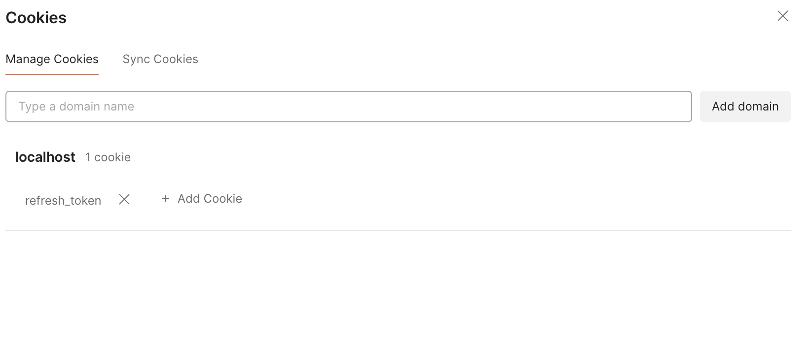
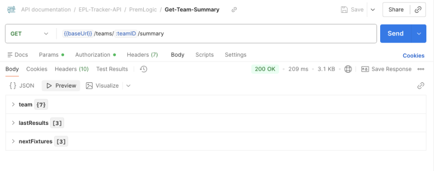
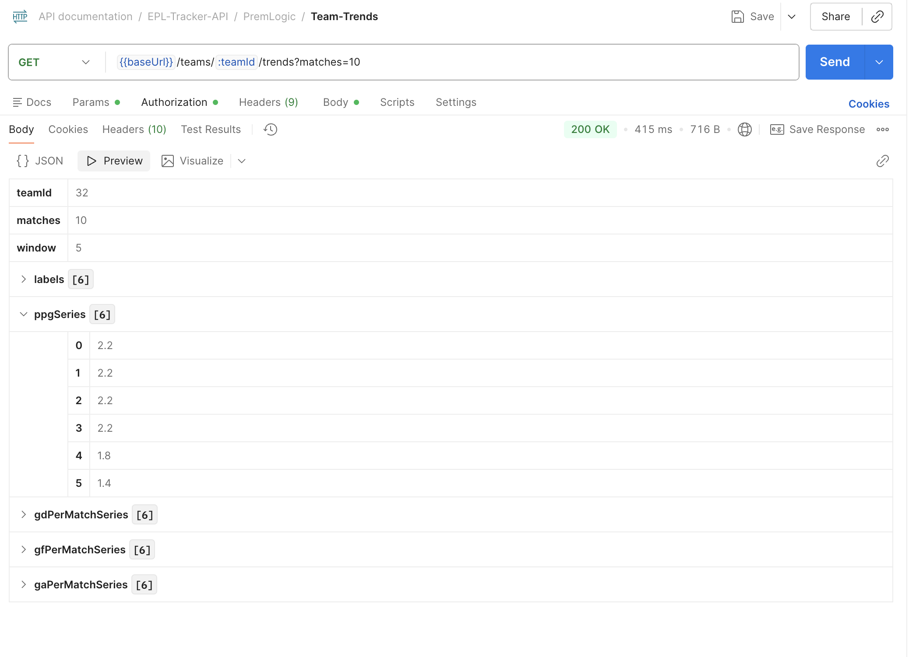
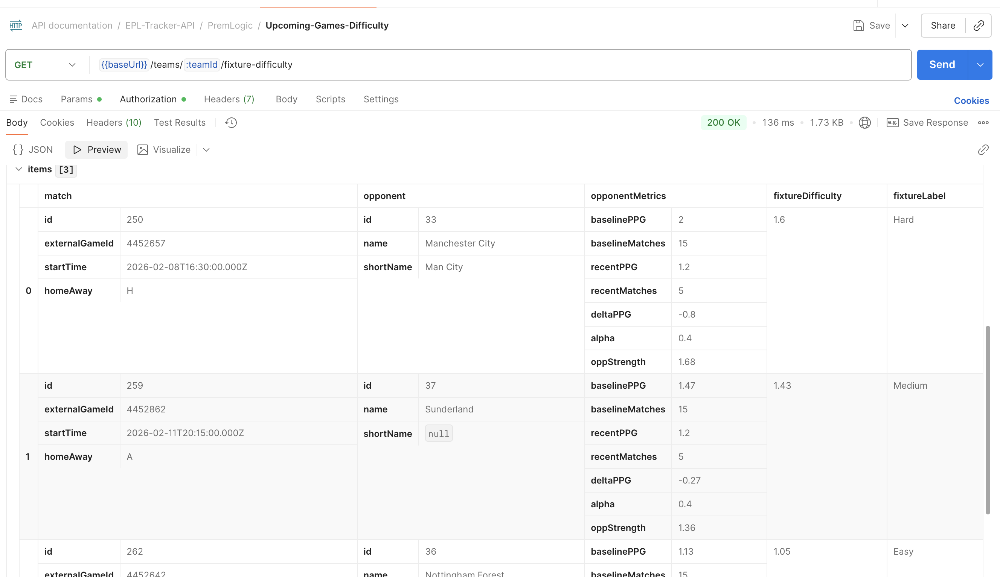
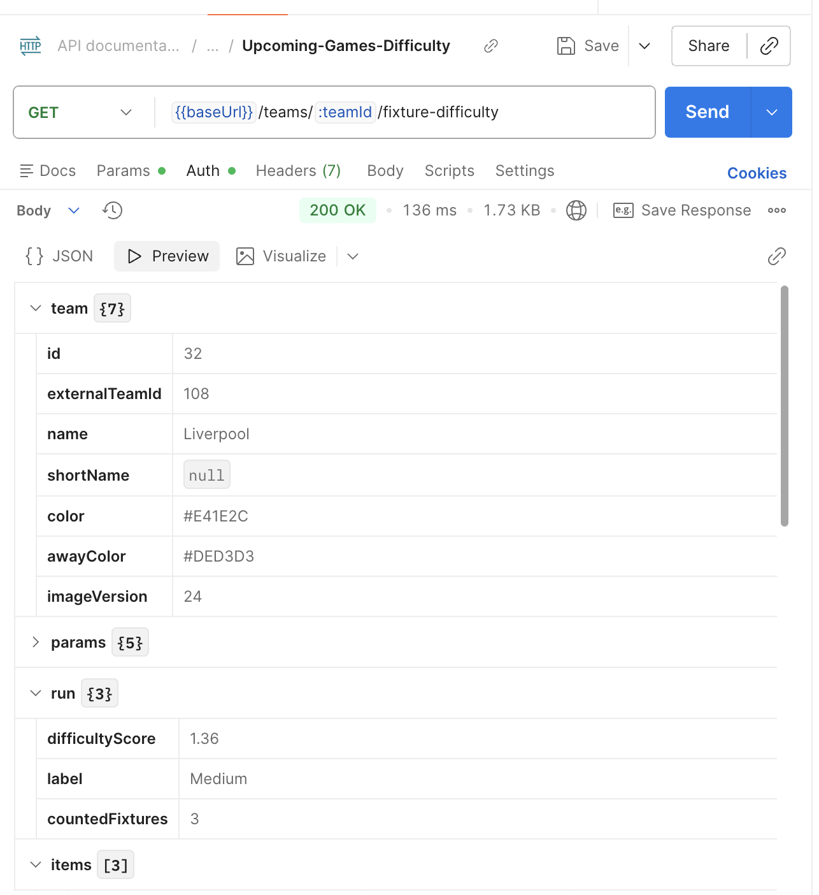
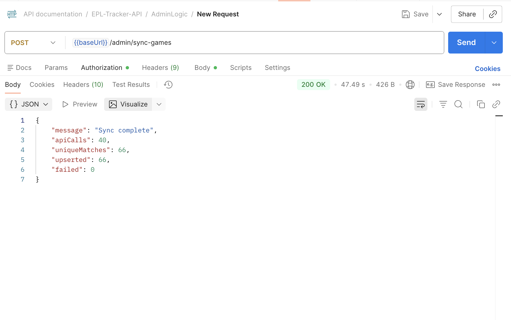

# ⚽ PremTracker — Premier League Analytics & Tracking Backend

**Demo Backend with Production Intent**

PremTracker is a Premier League analytics and tracking backend designed to go beyond simple API data display.  
It combines secure authentication, structured data ingestion, and lightweight mathematical modeling to give users meaningful insights into team form, trends, and fixture difficulty.

This repository currently represents a **demo backend**, built with production-ready architecture.  
A frontend and automated scheduling (cron / job queues) are planned future extensions.

---

## Project Goals

Most sports apps either:

- Dump raw data  
- Present opaque predictions with no explanation  

PremTracker aims to sit in the middle:

- Transparent analytics  
- Simple, explainable math  
- Production-grade backend design  

As a **Computer Science + Mathematics major**, the goal was to:

- Apply statistical reasoning (rolling windows, variance, weighted models)  
- Keep models interpretable  
- Design systems that could realistically scale to production  

---

## Key Features

### Authentication & Security

- JWT access tokens + rotating refresh tokens  
- Refresh tokens stored **hashed** in Postgres  
- Email verification flow (with resend support)  
- Cookie-based auth for production parity  
- Rate limiting via Upstash Redis  
- Admin-only protected routes  

**Refresh-token rotation & cookie-based auth**

```markdown

```

---

### Team Exploration & Match Data

Users can:

- Browse all Premier League teams  
- Click a team to view a dashboard-style summary  
- Drill into full match history  

Core data exposed:

- Last completed matches  
- Upcoming fixtures  
- Opponent context (home/away, perspective-based result)  

```markdown

```

---

### Team Form Analytics (Math-Focused)

Team form is computed from recent matches using:

- Points per game (PPG)  
- Goals for / against  
- Goal difference  
- Clean sheets  
- Volatility (standard deviation of points)  

Rather than labeling form as *good* or *bad*, the API returns metrics so interpretation remains transparent.

This avoids black-box scoring while still providing actionable insight.

---

### Rolling Trends (Sliding Window Analysis)

To capture momentum:

1. Select last N completed matches  
2. Slide a window of size M  
3. Compute per-window averages  

Metrics:

- PPG  
- Goals for / against  
- Goal difference  

This produces time-series data showing whether a team is:

- Improving  
- Stagnating  
- Declining  

```markdown

```

---

### Fixture Difficulty Modeling (Explainable Math)

Upcoming fixtures are scored using a weighted opponent-strength model:

```
OpponentStrength = baselinePPG + α · ΔPPG
```

Where:

- `baselinePPG` = long-run team strength  
- `ΔPPG` = recent momentum shift  
- `α ∈ [0.3, 0.5]` scales momentum  

This mirrors modeling in physics and differential equations:  
short-term signals are informative but noisy.

Produces:

- Per-fixture difficulty  
- Overall short-term outlook  

```markdown


```

---

### User Favorites & Email Notifications (Demo Mode)

- Users can favorite teams  
- Email notifications are opt-in only  
- Email verification required before enabling notifications  
- Demo endpoint allows users to trigger their own fixture email  

Production design:

- Cron / job queues  
- Batched per user  
- Scheduled delivery (e.g., Mondays)

---

### Admin Sync & Data Ingestion

- Admin-only EPL mini-sync job  
- Pulls last completed matches & next upcoming fixtures  
- Deduplicates across teams  
- Uses Postgres advisory locks  
- Sunday-only + rate limited  

```markdown

```

---

## API Overview

### Authentication

```http
POST /api/auth/register
POST /api/auth/login
POST /api/auth/refresh
GET  /api/auth/verify-email
POST /api/auth/request-verify
```

---

### Teams & Analytics

```http
GET /api/teams
GET /api/teams/:teamId/summary
GET /api/teams/:teamId/matches
GET /api/teams/:teamId/form
GET /api/teams/:teamId/trends
GET /api/teams/:teamId/fixture-difficulty
```

---

### User & Favorites

```http
POST   /api/me/favorites
DELETE /api/me/favorites/:teamId
POST   /api/me/email-opt-in
POST   /api/me/email-fixtures
```

---

### Admin

```http
POST /api/admin/sync-games
```

---

## Architecture Overview

### Backend Stack

- Node.js + TypeScript  
- Express  
- PostgreSQL (Neon)  
- Knex migrations  
- Upstash Redis  
- Resend (email)

### Key Design Choices

- Internal IDs + external API IDs  
- Hashed tokens only  
- Composite keys for favorites  
- Indexed match lookups  
- Service/controller separation  

---

## Demo vs Production

### Current (Demo)

- Emails can be logged instead of sent  
- Users manually trigger emails  
- Admin manually triggers sync  

### Production-Ready by Design

- Cron/queue driven jobs  
- Isolated email logic  
- Idempotent sync  
- Frontend pluggable without refactor  

---

## Future Roadmap

- Frontend (React / Next.js)  
- Scheduled cron jobs  
- Caching hot endpoints  
- Advanced models (xG, Elo)  
- Multi-competition support  

---

## Why This Project Matters

PremTracker isn’t about predicting match results.

It’s about:

- Building systems  
- Modeling uncertainty responsibly  
- Using math to inform, not obscure  
- Writing backend code that could survive production  
