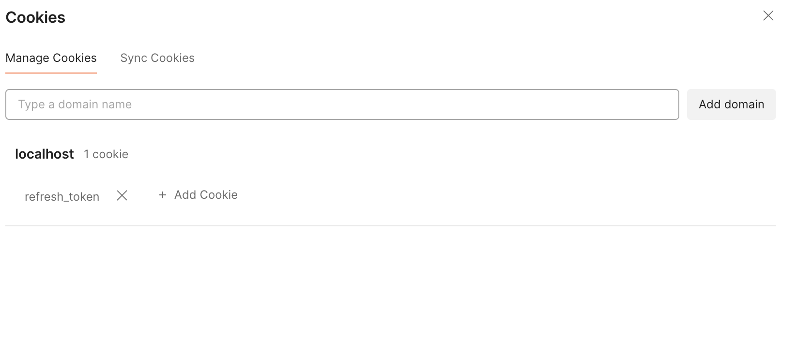
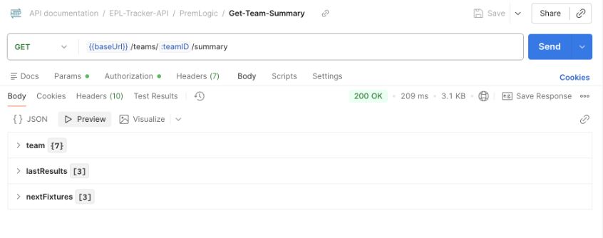
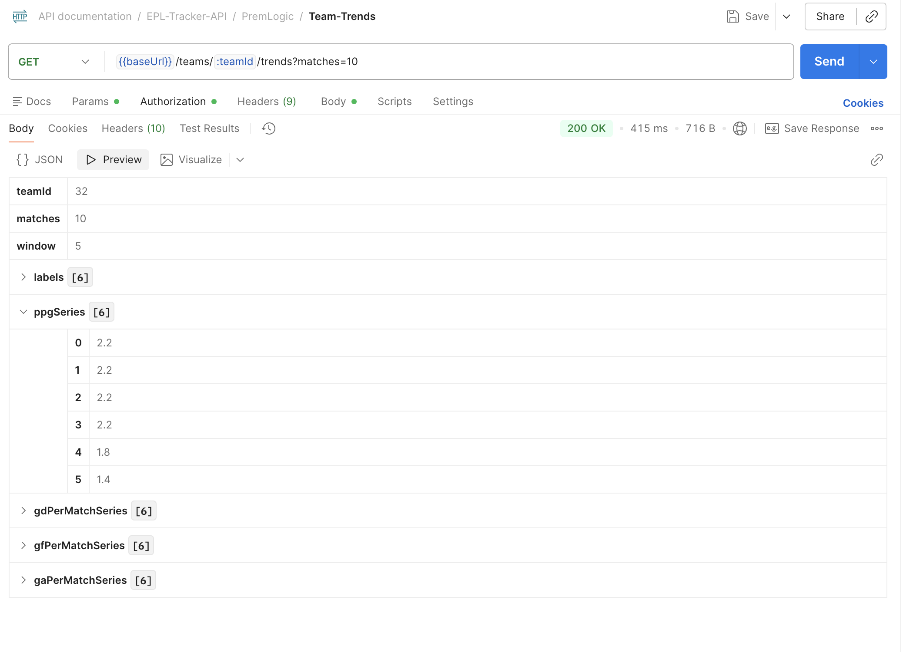
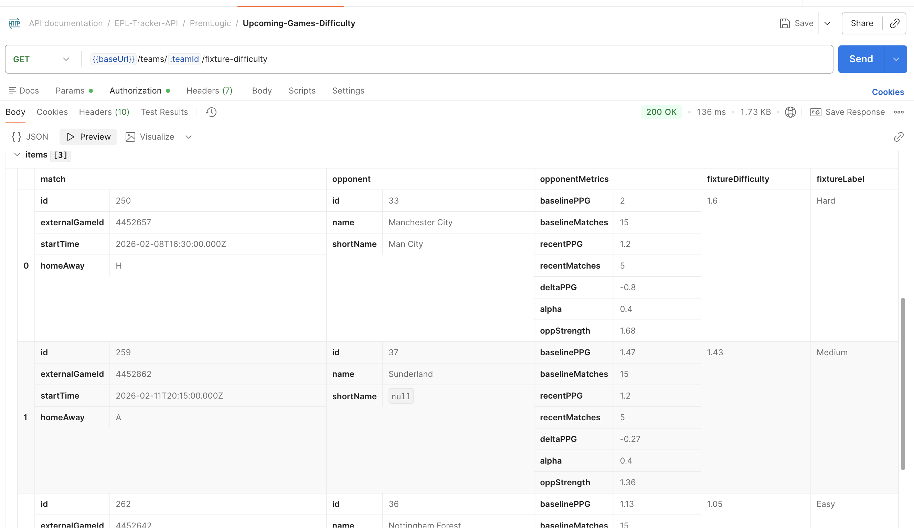
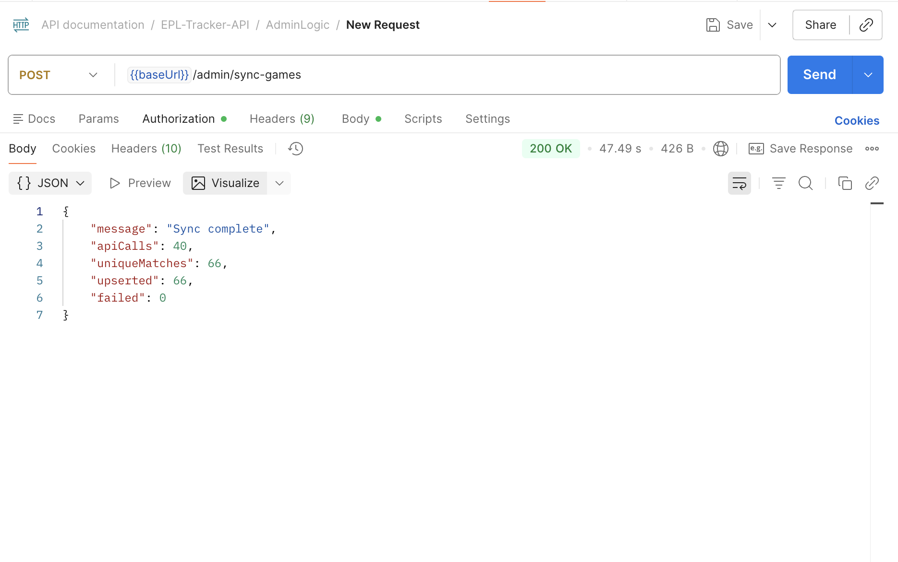

# PremTracker

PremTracker is a production-oriented Premier League analytics backend built with TypeScript, Node.js, Express, PostgreSQL, Knex, Upstash Redis, and Resend.

It is designed as the API layer for a full-stack football product: the backend is live on Render today, and a Vercel frontend is the next planned step. The goal is not black-box prediction. The goal is to expose transparent, explainable team analytics through a secure API that can realistically support a real client application.

**Deployed API base::** [https://premtracker-api.onrender.com](https://premtracker-api.onrender.com)  
**Health check:** [https://premtracker-api.onrender.com/api/health](https://premtracker-api.onrender.com/api/health)

**Frontend:** upcoming Vercel client

---

## What The Product Does

PremTracker lets authenticated users:

- browse Premier League teams
- inspect team summaries, historical matches, recent form, rolling trends, and fixture difficulty
- favorite teams
- manage email preferences
- receive fixture-related emails after verification and opt-in

It also includes protected admin tooling to keep match data fresh through a controlled EPL sync workflow.

This repository is the backend only. It is being built so a future Vercel frontend can consume it cleanly with:

- bearer access tokens for API requests
- rotating refresh tokens in `httpOnly` cookies
- CORS and cookie settings that support cross-origin frontend/backend deployment
- frontend-friendly email verification redirects
---

## Core Features

### 1. Auth And Session Security

- JWT access tokens
- rotating refresh tokens
- refresh tokens stored hashed in Postgres
- `httpOnly` refresh cookie flow
- email verification with Resend
- forgot-password and reset-password flow with one-time hashed reset tokens
- route protection for authenticated, verified, and admin-only actions
- rate limiting via Upstash Redis

<p align="center">
  
</p>

### 2. Team Exploration

- team list endpoint for browsing clubs
- team summary endpoint with last completed matches and next fixtures
- full match-history endpoint with result/fixture filtering
- perspective-aware result mapping from the selected team view

<p align="center">
  
</p>

### 3. Explainable Analytics

PremTracker focuses on interpretable metrics rather than opaque prediction scores.

Current analytics include:

- form snapshots from recent completed matches
- rolling-window trends for momentum analysis
- fixture difficulty scoring based on opponent strength and recent momentum

<p align="center">
  
</p>

<p align="center">
  
</p>

### 4. Favorites And Email Workflows

- users can favorite teams
- email reminders are opt-in only
- verified email is required before email workflows are enabled
- fixture digest sending supports local demo mode and live Resend delivery

### 5. Admin Sync Workflow

- admin-only sync endpoint
- Sunday-only execution guard
- Upstash-limited execution
- deduped EPL match ingest
- idempotent UPSERT-based updates into Postgres

<p align="center">
  
</p>

---

## Analytics Model Summary

### Team Form

Form is derived from recent completed matches using:

- points per game
- goals for and against
- goal difference
- clean sheets
- volatility from standard deviation of recent match points

The API also compares a recent window against a baseline window to label current form in a way that stays interpretable.

### Rolling Trends

The trends endpoint uses a sliding window over recent completed matches to produce series data for:

- points per game
- goal difference per match
- goals for per match
- goals against per match

This makes directional change visible without hiding the underlying math.

### Fixture Difficulty

Upcoming fixtures are scored with a weighted opponent-strength model:

```txt
opponentStrength = baselinePPG + alpha * (recentPPG - baselinePPG)
```

That score is then adjusted by venue context and returned with both per-fixture detail and an overall short-run label.

---

## API Overview

### Auth

```http
POST /api/auth/register
POST /api/auth/login
POST /api/auth/refresh
POST /api/auth/logout
GET  /api/auth/verify-email
POST /api/auth/request-verify
POST /api/auth/forgot-password
GET  /api/auth/reset-password
POST /api/auth/reset-password
GET  /api/auth/me
```

### Teams

```http
GET /api/teams
GET /api/teams/:teamId/summary
GET /api/teams/:teamId/matches
GET /api/teams/:teamId/form
GET /api/teams/:teamId/trends
GET /api/teams/:teamId/fixture-difficulty
```

### User

```http
GET    /api/me/settings
PATCH  /api/me/settings
GET    /api/me/favorites
POST   /api/me/favorites
DELETE /api/me/favorites/:teamId
POST   /api/me/email-fixtures
```

### Admin

```http
POST /api/admin/sync-games
```

---

## Backend Stack

- TypeScript
- Node.js
- Express
- PostgreSQL
- Knex migrations
- Upstash Redis
- Resend

---

## Architecture

PremTracker uses a straightforward backend structure built for maintainability:

```txt
src/
├── config/       # environment/service config
├── controllers/  # request/response orchestration
├── db/           # Postgres connection + shared types
├── middleware/   # auth, rate limiting, admin guards, errors
├── routes/       # route registration
├── scripts/      # seed and sync scripts
├── services/     # business logic, analytics, data access
├── utils/        # tokens, cookies, helpers
└── server.ts     # app entry point
```

Design choices:

- thin controllers, logic in services
- internal IDs plus external sports API IDs
- hashed refresh and verification tokens
- indexed match lookups
- explicit middleware layering for auth and permissions

---

## Deployment Status

The backend is deployed on Render and configured for production-style operation.

Current production-oriented behavior includes:

- startup config validation
- health-check endpoint
- Render-compatible build/start flow
- live Resend support
- cookie/CORS behavior for a future Vercel frontend
- frontend redirect support after email verification

Planned next step:

- build the frontend on Vercel and connect it to this API

---

## Local Development

### 1. Install

```bash
npm install
```

### 2. Configure Environment

Use [.env.example](.env.example) as the template.

For local development, the important defaults are:

```env
NODE_ENV=development
PORT=3001
PUBLIC_BASE_URL=http://localhost:3001
FRONTEND_ORIGINS=http://localhost:3000
EMAIL_MODE=demo
COOKIE_SAMESITE=lax
COOKIE_SECURE=false
```

### 3. Run Migrations

```bash
npm run migrate:latest
```

### 4. Start The Server

```bash
npm run dev
```

---

## Render Deployment

Recommended Render settings:

- Root Directory: leave blank
- Build Command: `npm ci && npm run build`
- Start Command: `npm start`
- Pre-Deploy Command: `npm run migrate:deploy`

Required production env values include:

- `DATABASE_URL`
- `JWT_ACCESS_SECRET`
- `PUBLIC_BASE_URL`
- `FRONTEND_ORIGINS`
- `COOKIE_SAMESITE=none`
- `COOKIE_SECURE=true`
- `UPSTASH_REDIS_REST_URL`
- `UPSTASH_REDIS_REST_TOKEN`
- `EMAIL_MODE=live`
- `RESEND_API_KEY`
- `EMAIL_FROM`
- `SPORTS_API_KEY`

If the frontend is not live yet, keep `FRONTEND_ORIGINS=http://localhost:3000` and leave `EMAIL_VERIFY_REDIRECT_URL` empty until the Vercel client exists.

---


## Summary

PremTracker is a strong backend-focused project because it combines:

- secure authentication and session handling
- relational data design
- third-party integrations
- protected admin workflows
- deployed production setup
- explainable analytics tied to a real user-facing product direction

It is not just a sports API wrapper. It is an intentionally engineered backend for a real application.
